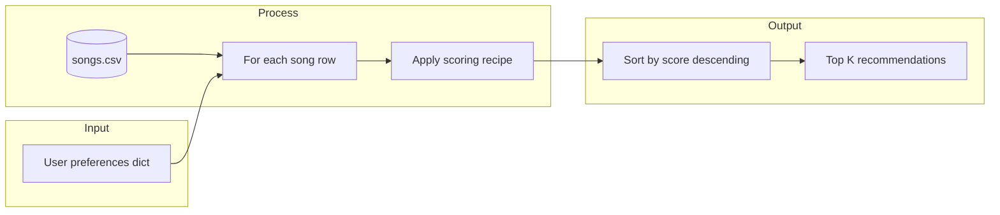

# 🎵 Music Recommender Simulation

## Project Summary

This repository is a **small, transparent content-based music recommender**: songs and a short user taste profile are represented as structured data, a hand-written **scoring rule** turns each song into a number, and the **top k** highest scores become the recommendations. The goal is to practice how real systems connect user signals to item metadata, while keeping the logic small enough to read, test, and critique. It is a **classroom simulation**, not a product-ready engine.

---

## How The System Works

This section is the **project plan in one place** (Step 5): data assumptions, a concrete taste profile for reasoning, the **finalized algorithm recipe**, expected biases, and how data flows through the program. Implementation lives in `src/recommender.py` and matches this design.

Large-scale services such as Spotify or YouTube typically blend many signals at once. They ingest **implicit feedback** (skips, replays, session length), **explicit signals** (likes, saves, follows), **social and contextual data** (time of day, device, playlists), and **content metadata or audio models** (genre tags, mood, tempo, embeddings). At scale, pipelines clean and join that data, train or tune models, and rank millions of items under latency and fairness constraints. Our project strips that down to a single idea you can read end-to-end: **connect a user taste sketch to song attributes with a hand-written scoring rule**.

**Plan summary:** use an **expanded CSV catalog** (18 rows: original 10 plus 8 diverse additions), represent the listener as a **small preference dictionary** (or the equivalent `UserProfile` in tests), apply **fixed weights** so each song gets one score, then **sort and take the top k**. That is the full bridge from user data to ranked song data for this simulation.

**What this version prioritizes:** it is deliberately **content-based** (each score comes from this catalog’s fields, not from “users like you”). It rewards **exact genre and mood string matches**, with **genre weighted higher than mood** (see recipe below). For **energy** it rewards **closeness to a target**, not “higher is always better.” It also nudges toward **more acoustic or more produced** tracks via `likes_acoustic`. Optional keys (`valence`, `danceability`, `tempo_bpm`) add smaller closeness terms when provided.

**`Song` features used in the simulation**

Each `Song` carries: `id`, `title`, `artist`, `genre`, `mood`, `energy`, `tempo_bpm`, `valence`, `danceability`, and `acousticness`. The recommender reads all of these from `data/songs.csv`. The core score always uses genre, mood, energy, and acousticness; tempo, valence, and danceability contribute **only when** those targets are supplied in the `user_prefs` dictionary passed to `score_song` / `recommend_songs` (for example from a richer CLI or experiment script).

**`UserProfile` fields used in the simulation**

The `UserProfile` dataclass stores: `favorite_genre`, `favorite_mood`, `target_energy`, and `likes_acoustic`. The `Recommender` class maps that profile into the same scoring logic as the functional API.

### Dataset (`data/songs.csv`)

The catalog lists **genre**, **mood**, and **energy** (0.0–1.0) for every track, plus **tempo_bpm**, **valence**, **danceability**, and **acousticness** for richer content-based scoring. The starter **10** rows were extended with **8** additional synthetic rows (IDs 11–18) so genres and moods span a wider range—for example **metal**, **folk**, **edm**, **hip hop**, **reggae**, and **classical**—without changing the CSV header format.

### Example taste profile (dictionary)

The CLI builds a small preference dictionary (same keys the scorer reads). One profile used for reasoning about **intense rock** vs **chill lofi**:

```python
taste_profile = {
    "genre": "rock",
    "mood": "intense",
    "energy": 0.9,
    "likes_acoustic": False,
}
```

**Profile critique (why this is not “too narrow”):** it names a **genre**, a **mood**, and a **high energy target**, so *Storm Runner* and *Granite Echo* should outrank calm lofi rows that only share a vague “intense” or high-energy feel without the rock tag. A bad profile would fix everything to one corner (for example rock + chill + very low energy), where almost nothing in a small catalog matches and the ranking becomes arbitrary ties among partial matches.

### Finalized algorithm recipe

For **each** song row, start the score at **zero**, then add the components below. The **scoring rule** maps one song + one user to a single number; the **ranking rule** is: compute that number for **every** song, **sort descending** by score, return the **top k** rows.

| Rule | Points |
|------|--------|
| Genre string equals user `genre` | **+2.0** |
| Mood string equals user `mood` | **+1.0** |
| Energy similarity | **+2.0 × (1 − \|song_energy − user_energy\|)** on the 0–1 energy scale |
| Acoustic taste | **+1.0 ×** acousticness if `likes_acoustic` is true, else **+1.0 × (1 − acousticness)** |

Optional (same “closer is better” pattern): if `user_prefs` includes `valence`, `danceability`, or `tempo_bpm`, add weighted similarity terms (constants in `src/recommender.py`).

Human-readable **reason strings** are assembled from the same checks so each line item can be explained without reading the code.

### Expected biases (brief)

- **Genre gate:** because genre match is worth **twice** the mood match, the system can **over-prioritize genre** and demote strong mood or energy fits in **other** genres—for example a great “happy” **edm** track may rank below a weaker “happy” **pop** track when the user asked for pop. That may be what you want for a “genre-first” session, or it may hide surprising alternatives.
- **Exact tags only:** synonyms (`electronic` vs `edm`) do not match; the catalog’s vocabulary partially steers who “wins.”
- **No collaborative signal:** excellent songs that depend on “people like you” discovery never enter the model.
- **Small catalog:** many profiles get **best-effort** partial matches, which can look arbitrary even though the math is deterministic.

### Data flow (Mermaid)



---

## Getting Started

### Setup

1. Create a virtual environment (optional but recommended):

   ```bash
   python -m venv .venv
   source .venv/bin/activate      # Mac or Linux
   .venv\Scripts\activate         # Windows
   ```

2. Install dependencies:

   ```bash
   pip install -r requirements.txt
   ```

3. Run the app:

   ```bash
   python -m src.main
   ```

   You should see a line like `Loaded songs: 18` (the count matches how many rows are in `data/songs.csv`; the starter had 10 before expansion), then ranked recommendations. Each “Because” line lists **reason strings** with point contributions, for example `genre match (+2.0)`.

**Core implementation checklist (module Steps 1–3)**

| Step | Requirement | Where it lives |
|------|----------------|----------------|
| 1 | `load_songs` reads CSV with `csv`, returns `list[dict]`, numerics as `float` / `id` as `int` | `load_songs` in `src/recommender.py` |
| 1 | Verify load in `main()` | `print(f"Loaded songs: {len(songs)}")` in `src/main.py` |
| 2 | `score_song` returns **score** + **reasons** (e.g. `genre match (+2.0)`) | `score_song` in `src/recommender.py` |
| 3 | `recommend_songs` scores every song, sorts **high → low**, returns top `k` | `recommend_songs` in `src/recommender.py` |
| 3 | `sorted()` vs `.sort()` | Ranking uses **`sorted(...)`** so a new ordered list is produced; **`.sort()`** mutates a list in place and returns `None` (see docstring on `recommend_songs`). The `Recommender` class uses the same pattern. |

### Running Tests

Run the starter tests with:

```bash
pytest
```

You can add more tests in `tests/test_recommender.py`.

### CLI verification (Step 4)

Run from the project root (with your virtual environment activated if you use one):

```bash
python -m src.main
```

`src/main.py` prints **four stress-test profiles** (High-Energy Pop, Chill Lofi, Deep Intense Rock, plus an **edge** profile with conflicting vibe: high energy + “moody” under `pop`), then a **fifth block** that repeats the High-Energy Pop profile under a **weight experiment** (energy weight ×2, genre weight ×0.5). Each block shows **rank**, **title**, **artist**, **score**, and **bullet reasons** from `score_song`.

**Course screenshot (optional):** if the rubric requires an image file, capture your terminal and save it as `docs/cli-screenshot.png`, then add this line to your README (or replace the block below):

``

**Sample terminal session** (same content as a successful local run):

```text
========================================================================
 Music Recommender — CLI-first simulation
========================================================================
Loaded songs: 18
Profile: genre='pop', mood='happy', energy=0.8
------------------------------------------------------------------------

Top recommendations (highest score first)

#1  Sunrise City
     Score:   5.70
       • genre match (+2.0) [pop]
       • mood match (+1.0) [happy]
       • energy similarity (+1.96) (song 0.82 vs target 0.80)
       • acoustic preference (+0.82) (favor produced)

---

## System evaluation (testing Steps 1–3)

### Step 1 — Stress profiles (see `PROFILE_RUNS` in `src/main.py`)

| Profile | Intent | Typical #1 (baseline weights) |
|--------|--------|-------------------------------|
| High-Energy Pop | `pop` + `happy` + high energy | **Sunrise City** (genre + mood + tight energy) |
| Chill Lofi | `lofi` + `chill` + low energy + acoustic | **Library Rain** (matches + acoustic tilt) |
| Deep Intense Rock | `rock` + `intense` + very high energy | **Storm Runner** |
| Edge: high energy + moody | `pop` + `moody` + very high energy | No row is `pop`+`moody`; **Gym Hero** (`pop`+`intense`) often leads with a **perfect energy** hit plus genre, while mood match stays unused. |

For each profile, capture terminal output if your rubric asks for **screenshots** (same `docs/` image tip as above).

### Step 2 — Accuracy, surprises, and “why #1”

For **High-Energy Pop**, **Sunrise City** is a good intuitive top pick: it is one of few rows with **both** genre and mood matches, and its energy sits close to the target, so it collects **+2 +1** plus a large energy-similarity term before acoustic preference.

**Variety note:** if the **same** title stayed at #1 for *every* profile, that would hint at **genre weight too strong** or a **too-small** catalog. Here #1 **changes** with the profile (lofi vs rock vs pop), which is what we want from a content-based stub.

### Step 3 — Small data experiment (implemented)

Change applied in code (not commented-out mood): **`experiment_energy_double_genre_half_weights()`** in `src/recommender.py` — **genre match weight halved**, **energy similarity weight doubled**, mood unchanged. `main` runs the **same** High-Energy Pop prefs with these weights.

**Observation:** **#1** stays **Sunrise City** (still the only full genre+mood double with strong energy), but **#2** moves from **Gym Hero** to **Pulse Check**: with a larger energy multiplier, **exact energy match** (`0.88` vs `0.88`) on a **happy** mood-only row can overtake another **pop** row that had slightly weaker energy similarity under baseline weights. So the change did not “fix” accuracy—it **re-ordered plausible alternatives** in a predictable direction.

---

## Experiments You Tried

- **Multi-profile CLI** (`python -m src.main`): four dictionaries in `PROFILE_RUNS` plus the weight experiment block; confirms rankings track stated genre/mood/energy instead of a single static demo.
- **Catalog expansion:** eight extra rows in `data/songs.csv` so rock, metal, edm, etc. appear in stress tests.
- **Sensitivity:** doubled energy / halved genre weights for one rerun; documented outcome in **System evaluation** above.
- **Optional numeric targets:** `valence`, `danceability`, or `tempo_bpm` in `user_prefs` still work via `score_song` (see **How The System Works** and [`model_card.md`](model_card.md)).

---

## Limitations and Risks

- **Small catalog:** with **18** songs, many user profiles still get “best available” picks that are only loosely aligned. There is no long-tail discovery.
- **No collaborative signal:** the system never learns from other listeners, so it cannot mimic “fans of X also like Y” behavior or recover from sparse metadata.
- **Exact tags only:** genre and mood must match strings exactly; synonyms (for example “edm” vs “electronic”) are not understood.
- **Narrow definition of taste:** energy similarity and optional targets are still a cartoon of listening behavior. Lyrics, culture, era, and social context are absent.
- **Risk if misused as a real product:** hard-coded weights could **systematically favor** certain genres or production styles present in the CSV, disadvantaging artists or communities underrepresented in the data. See the model card for a longer bias discussion.

---

## Reflection

Recommenders at scale are still, at bottom, **rules or models that map data to an ordering**. Building this simulation made that mapping visible: every recommendation is traceable to a small set of fields and weights, which is the opposite of a black-box feed—but also shows how quickly **design choices become values** (what we reward, what we ignore).

Bias and unfairness can appear even here: whoever built the playlist-shaped catalog and tag vocabulary is implicitly steering outcomes. A production system would need ongoing evaluation, diversity constraints, and governance; this project is only a starting point for that conversation.

The [**Model Card**](model_card.md) follows the course template (name through improvement ideas) and ends with **§9 Personal reflection**, which answers the four reflection prompts in full. Pair-by-pair evaluation notes for stress-test profiles are in [**reflection.md**](reflection.md).

---